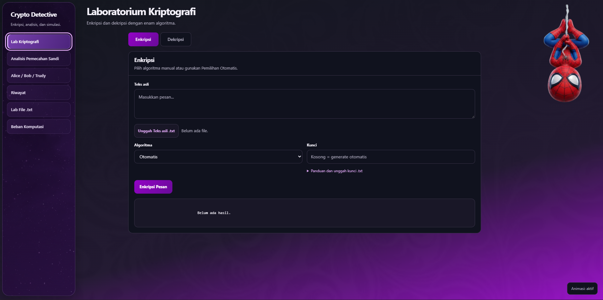
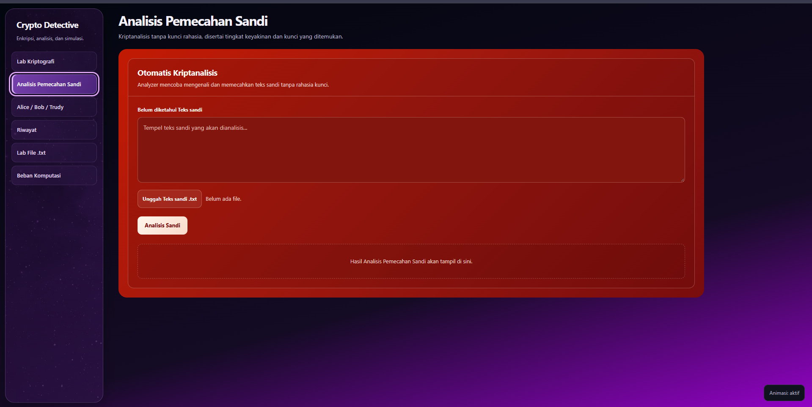
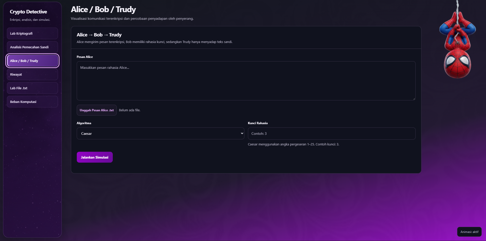
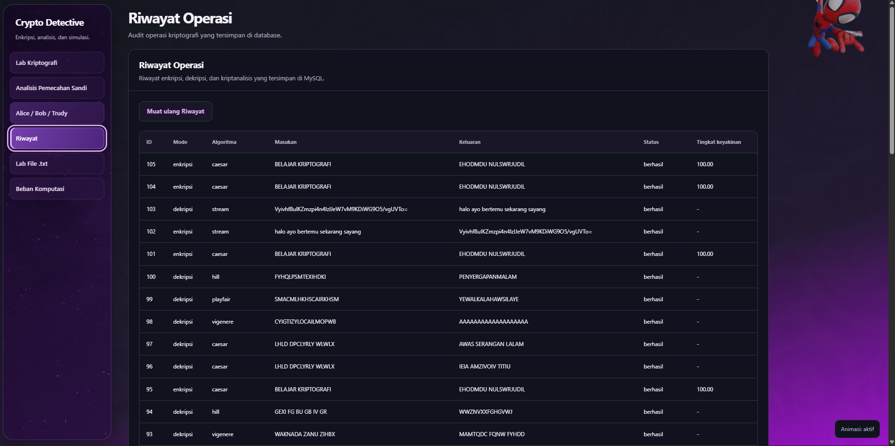
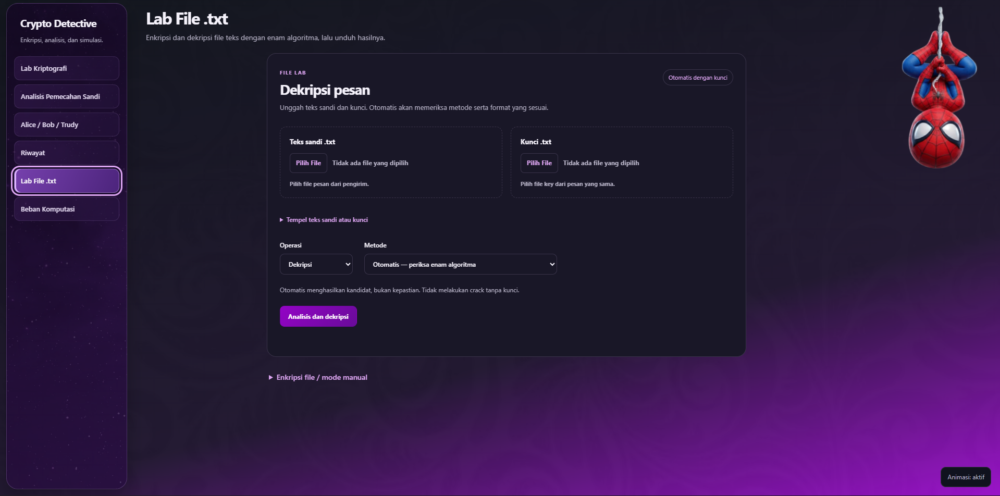
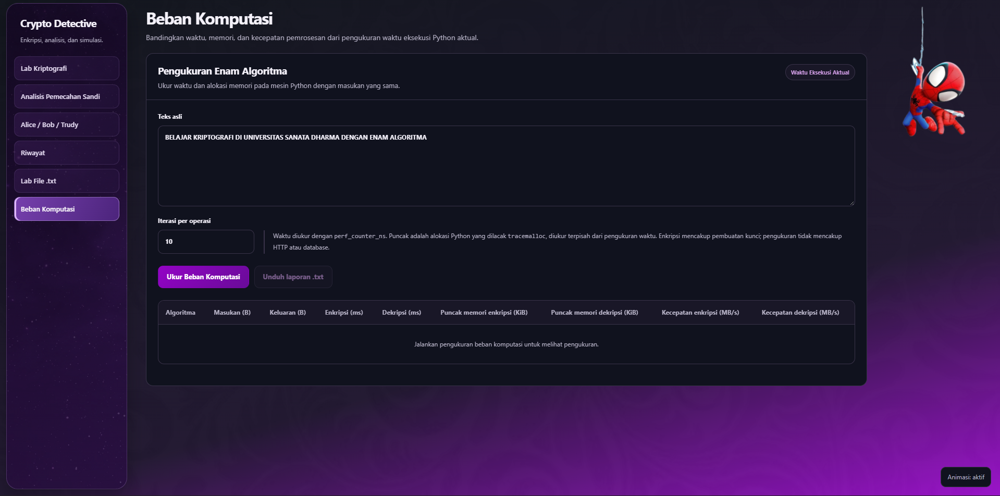

<div align="center">

# Crypto Detective

**Laboratorium kriptografi untuk mengenkripsi, mendekripsi, dan memahami pemecahan sandi.**

Enam algoritma · Lab pesan dan file `.txt` terpadu · Crack Analyzer · Riwayat · Metrik setiap operasi

[Mulai](#menjalankan-aplikasi) · [Galeri](#galeri-aplikasi) · [Algoritma](#enam-algoritma) · [Pengujian](#pengujian) · [Struktur](#struktur-project)

</div>



Crypto Detective adalah aplikasi pembelajaran kriptografi berbasis **Laravel dan Python**. Pengguna dapat memproses pesan atau file teks, memasukkan kunci secara manual maupun melalui file, mencoba analisis ciphertext, dan membandingkan waktu serta memori enam algoritma.

Project ini dikembangkan untuk tugas kriptografi di **Universitas Sanata Dharma**. Antarmuka menggunakan bahasa Indonesia, tema ungu, dan identitas merah khusus mode analisis pemecahan sandi.

## Fitur utama

| Modul | Fungsi |
|---|---|
| Laboratorium Kriptografi | Enkripsi/dekripsi pesan, unggah teks dan kunci, pilihan algoritma, salin serta unduh hasil |
| Analisis Pemecahan Sandi | Crack Analyzer V6: analisis tanpa kunci, kandidat plaintext, kunci yang ditemukan, dan tingkat keyakinan |
| Riwayat | Catatan operasi enkripsi, dekripsi, dan analisis yang tersimpan di database |
| Lab terpadu | Tempel pesan atau unggah `.txt`, unggah kunci, pilih metode atau Auto, pratinjau, dan unduh hasil serta kunci |
| Metrik operasi | Runtime aktual, ukuran input/output, throughput, puncak alokasi Python, dan teori tampil langsung bersama hasil Lab |

Antarmuka dilengkapi sidebar membulat, transisi ringan, serta maskot dua pose transparan. Animasi dapat dimatikan, mengikuti pengaturan *reduced motion*, dan maskot disembunyikan ketika ruang layar tidak cukup.

## Galeri aplikasi

<details>
<summary><strong>Analisis Pemecahan Sandi</strong> — mode analisis dengan identitas merah</summary>



</details>

<details>
<summary><strong>Alice / Bob / Trudy</strong> — simulasi komunikasi terenkripsi</summary>



</details>

<details>
<summary><strong>Riwayat Operasi</strong> — rekaman pengujian dan penggunaan</summary>



</details>

<details>
<summary><strong>Lab File .txt</strong> — pertukaran ciphertext dan kunci</summary>



</details>

<details>
<summary><strong>Beban Komputasi</strong> — perbandingan enam algoritma</summary>



</details>

Screenshot di atas merupakan dokumentasi versi sebelum penyederhanaan tiga menu dan menampilkan keadaan aplikasi dan data percobaan pada 6 Oktober 2026; galeri benchmark menampilkan formulir sebelum pengukuran dijalankan.

## Enam algoritma

| Algoritma | Kunci dan karakteristik |
|---|---|
| Caesar | Pergeseran huruf dengan kunci angka |
| Vigenère | Pergeseran berdasarkan kata kunci berulang |
| Playfair | Pasangan huruf dan tabel kunci 5×5; normalisasi I/J dan padding dapat mengubah bentuk teks |
| Hill 2×2 | Matriks invertible modulo 26; input kunci fleksibel dan validasi determinan/gcd |
| One-Time Pad | Core menggunakan XOR byte dengan kunci sepanjang data; antarmuka juga menyediakan format alfabet untuk kompatibilitas |
| Stream Cipher | Core menghasilkan keystream berbasis SHA-256 dan counter, lalu menerapkan XOR; representasi byte dapat dibaca melalui format yang didukung antarmuka |

Untuk Playfair dan Hill, hasil dekripsi dibandingkan dengan teks yang sudah dinormalisasi, termasuk padding bila diperlukan. Pemulihan spasi serta kapitalisasi asli tidak selalu tersedia.

### Auto dan Crack memiliki tujuan berbeda

- **Auto dengan kunci** memeriksa kemungkinan metode/format berdasarkan ciphertext dan kunci yang diberikan. Kandidat belum tentu merupakan pesan asli.
- **Crack Analyzer** mencoba pemulihan tanpa mengetahui kunci. Keberhasilannya bergantung pada algoritma, panjang teks, dan bukti yang tersedia.
- `compromised`: plaintext berhasil dipulihkan pada simulasi tersebut.
- `candidate_found`: ditemukan kandidat yang belum pasti benar.
- `protected`: plaintext tidak berhasil dipulihkan pada percobaan tersebut; status ini bukan bukti keamanan universal.

Dua aplikasi harus memakai aturan cipher, encoding, normalisasi, dan pembangkitan keystream yang sama agar hasilnya kompatibel. Aplikasi tidak dapat mendekripsi semua variasi OTP/stream hanya dari nama algoritmanya.

## Teknologi

| Lapisan | Teknologi |
|---|---|
| Aplikasi web | Laravel 13, PHP, Blade |
| Engine kriptografi | Python, FastAPI, Uvicorn |
| Database | MySQL pada lingkungan Laragon |
| Antarmuka | CSS dan JavaScript; halaman kriptografi memuat aset langsung dari `public/` |
| Pengujian | Python unittest, Laravel/PHPUnit, smoke test, simulasi PowerShell |

## Menjalankan aplikasi

### Persiapan pertama — Windows dan Laragon

Siapkan Git, Composer, PHP yang memenuhi `composer.json`, Python yang mendukung sintaks project, serta MySQL. Laragon dapat menyediakan PHP dan MySQL. Pastikan `git`, `php`, `composer`, dan `python` tersedia di PowerShell.

Clone repository:

```powershell
Set-Location 'C:\laragon\www'
git clone https://github.com/Satar2007/crypto-detective.git
Set-Location '.\crypto-detective'
composer install
Copy-Item '.env.example' '.env'
php artisan key:generate
```

Langkah ini untuk instalasi baru. Jika `.env` sudah ada, pertahankan konfigurasi lokal tersebut.

Buat database MySQL `crypto_detective`, kemudian sesuaikan bagian berikut pada `.env`:

```dotenv
APP_URL=http://crypto-detective.test
DB_CONNECTION=mysql
DB_HOST=127.0.0.1
DB_PORT=3306
DB_DATABASE=crypto_detective
DB_USERNAME=nama_pengguna_mysql_lokal
DB_PASSWORD=password_mysql_lokal
CRYPTO_ENGINE_URL=http://127.0.0.1:8100
```

Gunakan kredensial lokal sendiri; jangan commit `.env`. Setelah MySQL aktif:

```powershell
php artisan config:clear
php artisan migrate
Set-Location '.\python-engine'
python -m venv .venv
& '.\.venv\Scripts\python.exe' -m pip install fastapi 'uvicorn[standard]'
```

`python-engine/requirements.txt` saat ini masih mencatat dependensi core berbasis standard library. Engine HTTP membutuhkan FastAPI dan Uvicorn yang dipasang di atas.

Halaman kriptografi menggunakan CSS/JS dari `public/`; `npm run dev` tidak diperlukan untuk halaman ini. Tooling Vite tetap tersedia melalui `package.json` jika mengembangkan aset berbasis Vite.

### Setiap kali membuka aplikasi

1. Buka **Laragon → Start All** agar layanan web dan MySQL berjalan. Pastikan virtual host project menggunakan folder `public` sebagai document root.
2. Buka **PowerShell** dan jalankan engine:

```powershell
Set-Location 'C:\laragon\www\crypto-detective\python-engine'
& '.\.venv\Scripts\python.exe' -m uvicorn api:app --host 127.0.0.1 --port 8100
```

3. Biarkan PowerShell engine terbuka, lalu kunjungi **http://crypto-detective.test**.
4. Gunakan **Ctrl+0** untuk zoom 100% dan **Ctrl+F5** setelah memperbarui aset.

Jika virtual host belum tersedia, Laravel bisa dijalankan dari PowerShell kedua dengan `php artisan serve --host=127.0.0.1 --port=8000` pada root project, lalu buka `http://127.0.0.1:8000`. Engine Python tetap menggunakan port 8100.

Periksa engine dari PowerShell lain:

```powershell
Invoke-RestMethod 'http://127.0.0.1:8100/health' | ConvertTo-Json -Depth 5
```

## Workflow pertukaran file

1. Buka **Lab Kriptografi**, pilih mode enkripsi dan algoritma.
2. Unggah plaintext UTF-8, masukkan kunci atau gunakan pembangkitan otomatis pada mode yang mendukung.
3. Periksa pratinjau serta kunci yang digunakan, lalu unduh ciphertext `.txt`.
4. Penerima mengunggah ciphertext dan kunci yang sesuai untuk dekripsi. File kunci hanya berisi nilai kunci, tanpa label tambahan.
5. Untuk tugas serangan Trudy, kirim ciphertext tanpa kunci dan catat hasil analisis, kandidat, serta keterbatasannya.

Plaintext maksimum 2 MB, ciphertext dan kunci maksimum 3 MB untuk menampung ekspansi Base64. PHP `upload_max_filesize` dan `post_max_size` harus cukup untuk file serta overhead multipart (disarankan minimal 4M dan 8M). Pemisahan kunci dari ciphertext penting untuk membedakan penerima sah dari skenario penyerang.

## Beban komputasi

Setiap enkripsi/dekripsi Lab mengukur operasi yang menghasilkan output tersebut **sekali**, tanpa menjalankan ulang algoritma untuk mengukur memori.

- Runtime menggunakan `time.perf_counter_ns()`; termasuk pembangkitan kunci dan overhead `tracemalloc`.
- Puncak alokasi Python menggunakan `tracemalloc`, bukan total RAM proses. Aktivitas thread lain dapat ikut terukur.
- Ukuran input/output adalah byte UTF-8 teks yang diterima/dihasilkan engine; representasi ciphertext dapat berupa Base64. Konversi Hex di browser berada di luar pengukuran.
- Throughput dihitung dari byte input dibagi runtime. Kompleksitas teoretis dan penjelasan ditampilkan dalam rincian.
- HTTP, unggah file, database, tampilan, dan antrean lock tidak dihitung.

Menu simulasi, Lab File terpisah, dan benchmark telah dihapus dari tampilan. Endpoint lama serta regression test tetap dipertahankan untuk kompatibilitas. Auto dekripsi menampilkan kandidat dengan kunci yang diberikan, bukan jaminan identifikasi atau pengganti Crack Analyzer. Pemeriksaan kandidat Auto tidak disimpan di Riwayat.

## Pengujian

Baseline terakhir yang diverifikasi dari log lokal pada **6 Oktober 2026**:

| Pemeriksaan | Hasil |
|---|---|
| Python regression | 28/28 PASS |
| Laravel regression | 15/15 PASS, 91 assertions |
| `crypto:smoke` | 5/5 PASS |
| Simulasi enam algoritma dan isolasi rahasia | PASS |
| Round-trip file enam algoritma, Hill custom, dan validasi input | PASS |
| Benchmark runtime aktual enam algoritma | PASS |
| Integrasi Auto, ambiguitas format, dan editor kunci Hill | PASS |

Ini hasil pengujian lokal, bukan badge atau jaminan CI untuk setiap commit.

Dengan layanan web, MySQL, dan engine aktif, jalankan dari root project:

```powershell
Set-Location 'C:\laragon\www\crypto-detective'
Push-Location '.\python-engine'
try { & '.\.venv\Scripts\python.exe' run_tests.py } finally { Pop-Location }
php artisan test
php artisan crypto:smoke
powershell.exe -NoProfile -ExecutionPolicy Bypass -File '.\Test-All-Crypto-Simulations.ps1'
```

Smoke test dan simulasi menulis record pengujian ke database lokal. Pemeriksaan visual desktop/mobile tetap diperlukan setelah mengubah UI.

## Struktur project

| Lokasi | Isi |
|---|---|
| `app/Http/Controllers/` | Endpoint operasi kripto, simulasi, file, dan benchmark |
| `app/Services/CryptoEngineService.php` | Komunikasi Laravel dengan engine Python |
| `routes/web.php`, `routes/api.php` | Route tampilan dan API |
| `resources/views/crypto/` | Blade utama dan partial coursework |
| `public/css/`, `public/js/` | Design system, antarmuka, format kunci, dan interaksi |
| `public/images/` | Aset maskot transparan |
| `python-engine/api.py` | Endpoint HTTP FastAPI |
| `python-engine/crypto_engine/ciphers/` | Implementasi enam algoritma |
| `python-engine/crypto_engine/service.py` | Service pemilihan algoritma dan operasi kripto |
| `python-engine/coursework_benchmark.py` | Pengukuran waktu, memori, throughput, dan teori |
| `python-engine/tests/`, `tests/` | Regression test Python dan Laravel |
| `database/migrations/` | Struktur database |
| `docs/screenshots/` | Screenshot dokumentasi |

## API utama

| Metode | Route Laravel | Fungsi |
|---|---|---|
| GET | `/api/crypto/health` | Status engine |
| POST | `/api/crypto/encrypt` | Enkripsi |
| POST | `/api/crypto/decrypt` | Dekripsi |
| POST | `/api/crypto/crack` | Analisis tanpa kunci |
| GET | `/api/crypto/history` | Daftar riwayat |
| POST | `/api/simulation/run` | Jalankan simulasi |
| GET | `/api/simulation/{id}/trudy` | Respons khusus Trudy |
| POST | `/api/coursework/file-process` | Pemrosesan file |
| POST | `/api/coursework/benchmark` | Pengukuran enam algoritma |

## Catatan penggunaan

Project ditujukan untuk pembelajaran dan eksperimen lokal. Cipher klasik serta implementasi stream demonstrasi ini bukan pengganti protokol kriptografi modern untuk data produksi. OTP memiliki sifat keamanan ideal hanya ketika kunci benar-benar acak, sepanjang pesan, dirahasiakan, dan digunakan satu kali.

Aset maskot merupakan materi visual pihak ketiga yang disediakan untuk antarmuka project; aset tersebut bukan karya atau merek milik pengembang. Laravel dan dependensi lain memiliki lisensi masing-masing. README ini tidak menetapkan lisensi baru untuk seluruh project.

## Pengembang

**Rafael Paskah Bintang Pinasthi**
Informatika — Universitas Sanata Dharma
GitHub: [Satar2007](https://github.com/Satar2007)

## Validasi penyederhanaan Lab

Python: 36/36 lulus di lingkungan pengembangan, termasuk delapan tes metrik baru. Tes alur JavaScript menggunakan adapter ke core Python, bukan pengganti pengujian Laravel atau browser. Jalankan `Test-Integrated-Lab.ps1` di Windows untuk regression Laravel, smoke, simulasi API lama, file, benchmark API lama, dan metrik operasi. Periksa tiga menu, desktop/mobile, Crack merah, History, upload/download, Hill, dan kandidat Auto secara manual.


## Lab interoperabilitas

GUI tetap milik **Crypto Detective**: enam algoritma, tanpa profil bernama teman.
Saat enkripsi, OTP/Stream menampilkan varian; empat metode klasik menyediakan
pengaturan lanjutan. Saat dekripsi, varian/format yang didukung dicoba otomatis
untuk algoritma pilihan (atau deteksi seluruh algoritma), dan hasil dipilih pengguna.
Hasil yang sama dikelompokkan; tiga kandidat pertama tampil, sisanya dapat dibuka.
Keterbacaan hanya mengurutkan kandidat, bukan bukti kebenaran plaintext.

| Metode | Dukungan |
| --- | --- |
| Caesar | Bentuk teks asli atau normalisasi A–Z kapital |
| Vigenère | Bentuk teks asli atau normalisasi A–Z kapital |
| Playfair | J→I; filler X atau X/Q; filler tetap dipertahankan |
| Hill | Core asli 2×2; matriks 2×2/3×3 vektor kolom, padding X, key invertibel |
| OTP | XOR byte Hex/Base64; XOR karakter dengan key teks; alfabet A=0 modulo 26 |
| Stream | SHA-256 counter; RC4 karakter; RC4 byte UTF-8 Hex/Base64; LCG modulo 256 |

Generate key membuat key sesuai aturan pilihan dan panjang plaintext untuk OTP.
OTP byte memakai pad acak penuh sepanjang byte. Key pendek tidak diulang diam-diam.
OTP karakter menerima key minimal sepanjang karakter pesan untuk interoperabilitas;
pad teks buatan sendiri/generator huruf tidak menjamin keamanan OTP byte.
RC4 dan LCG hanya untuk pembelajaran; LCG mempunyai 256 seed. Tidak ada autentikasi
ciphertext, sehingga key yang salah dapat menghasilkan teks terbaca.

Untuk bertukar dengan kode Rafael: bentuk teks asli Caesar/Vigenère, Playfair filler X,
Hill 2×2, OTP XOR karakter, Stream RC4 karakter. Untuk kode Dika: normalisasi A–Z,
Playfair X/Q, Hill matriks, OTP XOR byte Hex, Stream LCG Hex. Ini petunjuk dokumentasi,
bukan pilihan profil GUI. Varian harus cocok pada penerima; satu ciphertext RC4 tidak
bisa langsung digunakan sebagai LCG. Normalisasi/filler membatasi round-trip bentuk asli.

Upload/download `.txt` UTF-8 menjaga BOM, CRLF, karakter NULL dan spasi. Nilai asli
file disimpan terpisah dari textarea; setelah diedit, teks hasil edit digunakan.
Jalur API baru mengangkut teks/key dengan Base64 agar middleware tidak melakukan trim.
RC4 karakter memakai kode Unicode seperti aplikasi Rafael; RC4 byte memakai UTF-8.
Pembaca file penerima yang menormalkan CR/LF dapat merusak ciphertext karakter mentah;
format Hex/Base64 hanya membantu bila penerima juga mendukung format tersebut.
Batas plaintext 2 MB; ciphertext/key 6 MB. Ciphertext/key unduhan tidak ditambah header.

Metrik berasal dari satu operasi aktual yang menghasilkan kandidat terpilih, bukan total
waktu semua percobaan Auto. Transport HTTP/Base64 web dan waktu Generate di browser
tidak dihitung. Key kosong saat enkripsi dibangkitkan di engine dan masuk waktu operasi.
Percobaan kandidat tidak menambah Riwayat; enkripsi dicatat bersama varian/format.
Endpoint legacy tetap dipertahankan untuk regression; core asli dan Crack V6 tidak diubah.

Fungsi kompatibilitas normalisasi diadaptasi dengan atribusi dari CryptoZar,
**Andika Novanda Putra (245314084)**. Referensi tambahan adalah kode Rafael dan
`TOP_SECRET.zip` yang diberikan pemilik project. Pengujian memakai 35 vektor dari
kode Dika serta enam file nyata Rafael, enkripsi dan dekripsi dua arah.

Tes lengkap Windows PowerShell, setelah restart Python engine:

```powershell
powershell.exe -NoProfile -ExecutionPolicy Bypass -File .\Test-Interop-Lab.ps1
```

Script menjalankan regression Python/Laravel, smoke, simulasi legacy, file/benchmark/
metrik, kompatibilitas legacy, API interop dan karakter mentah. Smoke/simulasi menambah
record uji. Pemeriksaan visual desktop/mobile dan pertukaran file pada GUI penerima
masih perlu dilakukan; tes fungsi murni tidak menggantikan uji file I/O aplikasi penerima.
